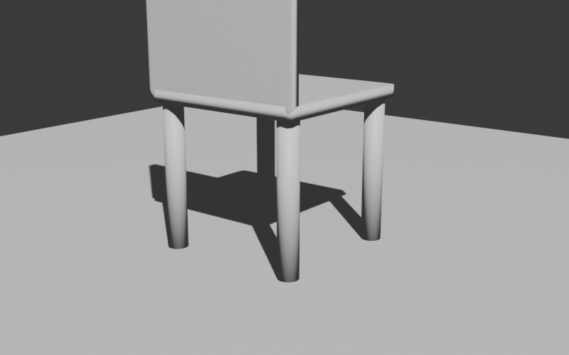

# BlenderSkill

AIに **Blenderのスキルを段階的に蓄積させる** ための個人学習プロジェクト。
「ネットで情報収集 → Blenderで実行 → 振り返り → ノウハウ蓄積」のサイクルを繰り返し、再現可能な知識ベースを構築する。

## 🎯 現在のステータス

| 項目 | 内容 |
|---|---|
| **フェーズ** | Phase 2 モデリング編（はじめての家具完成）|
| **最終更新** | 2026-05-04 |
| **直近の動き** | Phase 1 全消化 / bmesh / Extrude / ループカット+ベベル / **シンプルな椅子モデル完成** |
| **次のアクション** | オブジェクト結合とブーリアン（穴あけ）→ Phase 3（マテリアル編）|

## 🪑 直近の成果



*Phase 1〜2 で習った技を組み合わせて作ったパラメトリックな椅子（[スクリプト](snippets/simple_chair.md)）*

## 🚀 はじめに見るべき3つ

1. [いまのタスク](tasks.md) — 次に何をやればいいかが一覧
2. [学習ログ](log.md) — 時系列の作業記録（最新が上）
3. [ノウハウ集](memory/index.md) — カテゴリ別のリファレンス

## 💡 このプロジェクトの目的

- AIにBlenderの **動く知識** を持たせる（読むだけでなく実行で検証する）
- 失敗もすべて記録して、次回のセッションで繰り返さない
- 再利用可能なPythonスニペットを蓄積していく
- 最終的には「こういう作品を作って」と言えば組み上がる状態を目指す

## 🛠 技術スタック

| 項目 | 内容 |
|---|---|
| 3Dソフト | Blender（MCPアドオン経由でAIから操作）|
| AI制御 | Claude（Cowork）+ Blender MCP |
| 言語 | Python（`bpy`）|
| ドキュメント | MkDocs + Material for MkDocs（このサイト）|
| ホスティング | GitHub Pages |

## 🗺 学習ロードマップ

| Phase | 内容 | ステータス |
|---|---|---|
| 1 | 基礎編（プリミティブ・トランスフォーム・モディファイア）| ✅ 完了 |
| 2 | モデリング編（編集モード・押し出し・ベベル・bmesh）| 🟢 着手中（椅子完成）|
| 3 | マテリアル編（Principled BSDF・PBR・UV・ノード）| ⚪ 未着手 |
| 4 | ライティング・レンダリング編（HDRI・Cycles・Eevee・カメラ）| ⚪ 未着手 |
| 5 | 応用編（アニメ・パーティクル・ジオメトリノード・AI生成）| ⚪ 未着手 |

詳細は [いまのタスク](tasks.md) を参照。

## 📁 リポジトリ構成

```
BlenderSkill/
├── CLAUDE.md          # AIへの指示（プロジェクトガイド）
├── mkdocs.yml         # サイト設定
├── docs/              # 公開ドキュメント（このサイトの中身）
│   ├── index.md       # このページ
│   ├── log.md         # 学習ログ
│   ├── tasks.md       # ロードマップ
│   ├── memory/        # カテゴリ別ノウハウ
│   ├── snippets/      # スニペット解説
│   └── images/        # スクリーンショット
├── snippets/          # 実行用 .py（Blender に流すコード）
├── outputs/           # .blend / レンダリング結果
└── update.bat         # GitHub Pages へワンクリックデプロイ
```

## 🔄 セッションごとの基本フロー

1. [タスクリスト](tasks.md) から次の課題を選ぶ
2. ネット・公式ドキュメントで情報収集
3. Blender MCP で実行（`mcp__blender__execute_blender_code`）
4. ビューポートのスクリーンショットで目視確認
5. 学習ログ・ノウハウ・スニペ