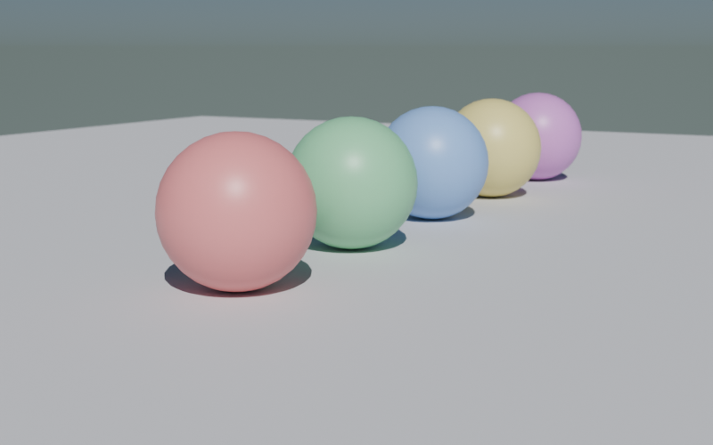

# camera_dof.py — 被写界深度で作品っぽく仕上げる

カメラの **Depth of Field（被写界深度）** を効かせると、ピントの当たった部分が際立って作品感が一気に出る。



## コード

```python
--8<-- "snippets/camera_dof.py"
```

## 焦点距離（lens）の使い分け

| mm | 種類 | 用途 |
|---|---|---|
| 16-24 | 超広角 | 部屋全体・パノラマ |
| 35 | 広角 | 風景・寄り気味の風景 |
| 50 | 標準 | 一般撮影、汎用 |
| 85 | 中望遠 | ポートレート、ぼけ強め |
| 135-200 | 望遠 | 圧縮効果、被写体強調 |

mm が大きいほど **画角が狭く、ぼけが強くなる**。

## 絞り（f-stop）

| f値 | ぼけの強さ |
|---|---|
| f/1.4 | 大ボケ（ポートレート向き）|
| f/2.0 | 強めのボケ |
| f/4.0 | 適度なボケ |
| f/8.0 | ほぼ全焦点 |
| f/16 | パンフォーカス |

**小さい f値 = ボケる、大きい f値 = 全部くっきり**。

## フォーカスの当て方

```python
# (A) 距離で指定
cam.data.dof.focus_distance = 3.0   # メートル

# (B) オブジェクトで指定（移動に追従、便利）
cam.data.dof.focus_object = bpy.data.objects["target"]
```

オブジェクト指定が便利。被写体が動いても自動でピントが合う。

## 構図のコツ

- **三分割構図**: 画面を縦横3等分した線・交点に被写体を置く
- **奥行きを作る**: 手前・中央・奥 に何かを配置すると DoF が活きる
- **望遠で寄る** > **広角で離れる**: 同じ大きさに写しても望遠のほうが背景が圧縮されて整う

## 注意

- DoF は Cycles でも Eevee でも有効
- `aperture_fstop` を 1.4 まで下げるとレンダリング時間が増える（ボケ計算が重い）
- カメラを動かすときは `focus_object` を使うとピントずれを防げる
