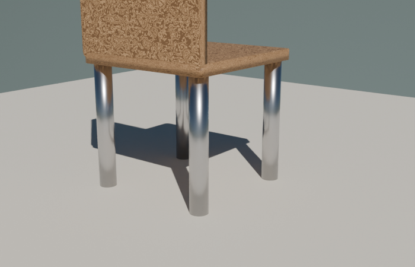
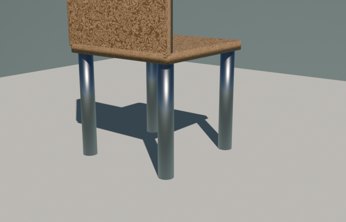

# cycles_vs_eevee.py — レンダリングエンジン比較

同じシーンを Cycles と Eevee の両方でレンダーして比較する。

| Cycles | Eevee |
|---|---|
|  |  |

## コード

```python
--8<-- "snippets/cycles_vs_eevee.py"
```

## 性質の違い

| 項目 | Cycles | Eevee |
|---|---|---|
| 計算方式 | パストレース（光線追跡）| ラスタライズ（GPU リアルタイム）|
| 速度 | 遅い（数秒〜数分）| 速い（瞬時）|
| 反射 | 物理的に正確 | 近似（SSR / Reflection Probes）|
| 屈折 | 正確 | 近似 |
| 影 | きれい・正確 | 速いがやや雑 |
| ノイズ | 低サンプルだとザラつく | ノイズなし |
| 用途 | 最終レンダリング・作品 | プレビュー・アニメ |

## どっちを使う？

- **学習中・調整中**: Eevee（速い）
- **完成画像・動画フレームごとの長時間レンダー**: Cycles（綺麗）
- **アニメーションで実時間性が重要**: Eevee
- **PBRテクスチャの正確な見た目**: Cycles

## エンジン切替コード

```python
scene.render.engine = 'CYCLES'                # or 'BLENDER_EEVEE_NEXT' / 'BLENDER_EEVEE'
scene.cycles.samples = 96                     # Cycles のみ
scene.cycles.use_denoising = True             # Cycles のみ（重要）
```

`BLENDER_EEVEE_NEXT` は Blender 4.2+ の新しい Eevee。`BLENDER_EEVEE` は旧Eevee。利用可能なものを実行時に判定:

```python
available = [e.identifier for e in bpy.types.RenderSettings.bl_rna.properties['engine'].enum_items]
eevee = 'BLENDER_EEVEE_NEXT' if 'BLENDER_EEVEE_NEXT' in available else 'BLENDER_EEVEE'
```
