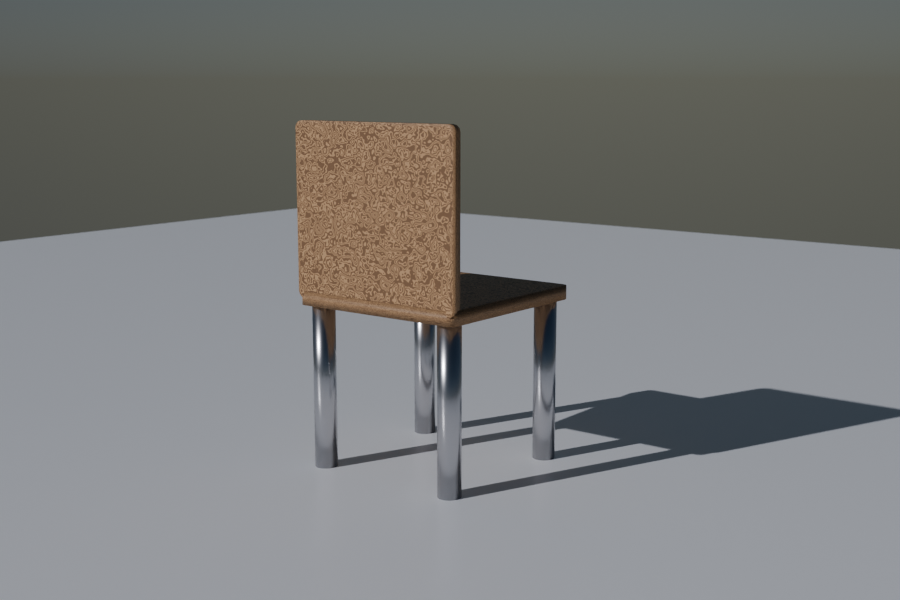

# final_snowy_chair — Phase 1〜5 の集大成

全5フェーズで習った技を **すべて1本のスクリプト** に統合した最終作品。

## 使用技術の対応表

| Phase | 技術 | この作品での使用箇所 |
|---|---|---|
| 1 | Plane / Cube / Cylinder | 床 / 座面 / 脚 |
| 1 | for ループ配置 | 4本の脚を符号反転 for で対称配置 |
| 2 | 角丸ボックス（subdivide+bevel） | 座面と背もたれの仕上げ |
| 2 | UV smart_project | テクスチャの歪み防止 |
| 3 | Principled BSDF | 金属脚・雪のマテリアル |
| 3 | プロシージャル木目（ノードグラフ）| 座面と背もたれの木目 |
| 4 | Sky Texture (Hosek/Wilkie) | 寒色寄りの空 |
| 4 | Sun ライト | はっきりした影 |
| 4 | カメラ DoF（50mm f/4.0）| 椅子にピント、奥がふんわり |
| 4 | Cycles + Denoising | 物理ベースの綺麗なレンダー |
| 5 | 散布（Linked Duplicate）| 800個の雪片 |

## 作品設計の振り返り

- 椅子は Phase 2 の `add_rounded_box()` ヘルパーをそのまま再利用
- 雪片は Phase 5 の `scatter_snow()` 相当をインライン化
- 環境光は Phase 4 の `setup_sky_world()` を曇り設定（turbidity=4.0）に
- 光は寒色寄りの Sun（color=(0.95, 0.95, 1.0)）で雪景色感を出す

## 改造アイデア

- 雪片の色を **薄青** に変えて床と差別化（散布が見えやすくなる）
- カメラを更に引いて、雪片が画面いっぱいになる構図に
- 椅子を **AI生成** に置き換える（Hyper3D が有効ならその方法も可）
- フレーム1〜120で椅子をゆっくり回転させて **動画化**

## まとめ

たった1本のスクリプトで、

- モデリング
- マテリアル（プロシージャル + コードノードグラフ）
- ライティング・空・カメラ
- 散布

までを全部やりきれる。**Pythonで Blender を駆動する技** が体に入った。
