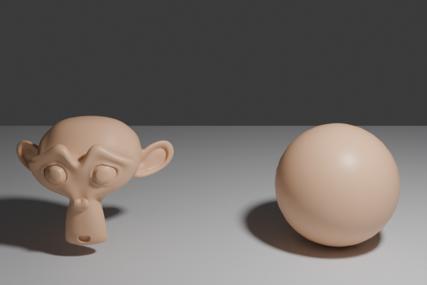
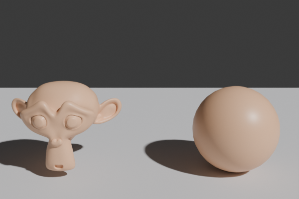
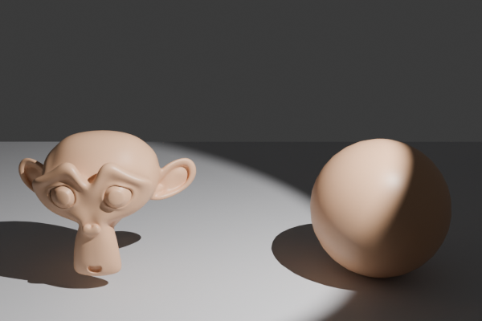
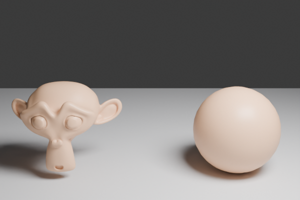

# light_comparison.py — ライト4種の見え方比較

`Point` / `Sun` / `Spot` / `Area` の4種類のライトを同じシーンに当てて、それぞれの光の性質を比較。

## 4種の比較画像

| ライト | 性質 |
|---|---|
| Point  | 一点から全方向に放射。距離で減衰。電球のイメージ |
| Sun  | 平行光線。シーン全体に均一。距離無関係。屋外の太陽 |
| Spot  | 円錐状の光。`spot_size` で角度、`spot_blend` で縁のぼかし。スポットライト |
| Area  | 面光源。`size` で大きさ。**柔らかい影**が出る。撮影スタジオのソフトボックス |

## コード

```python
--8<-- "snippets/light_comparison.py"
```

## ライトタイプ別の主要パラメータ

| 共通 | 意味 |
|---|---|
| `data.energy` | 強度。Point/Spot は W、Sun は Lx 相当、Area は W |
| `data.color` | 光の色（RGB）|
| `data.shadow_soft_size` | 影のボケ具合（Point/Spot/Sun）|

| Sun | 意味 |
|---|---|
| `data.angle` | 太陽の見かけの大きさ（ラジアン）。大きいほど影がボケる |

| Spot | 意味 |
|---|---|
| `data.spot_size` | 円錐の頂角（ラジアン）|
| `data.spot_blend` | 縁のソフトさ（0〜1）|

| Area | 意味 |
|---|---|
| `data.size` | 正方形なら一辺、長方形なら X 方向の長さ |
| `data.shape` | `'SQUARE'`, `'RECTANGLE'`, `'DISK'`, `'ELLIPSE'` |
| `data.size_y` | RECTANGLE/ELLIPSE のときの Y 方向の長さ |

## どれを選ぶ？

| シーン | 推奨 |
|---|---|
| 屋外（昼）| **Sun** + 環境光 |
| 屋内（窓越し）| **Sun** + 窓の Area で間接光 |
| 撮影スタジオ風 | **Area**（柔らかい影が綺麗）|
| 演出用スポット | **Spot**（演劇・店舗ディスプレイ風）|
| ろうそく・電球 | **Point**（暖色 + `shadow_soft_size`）|
