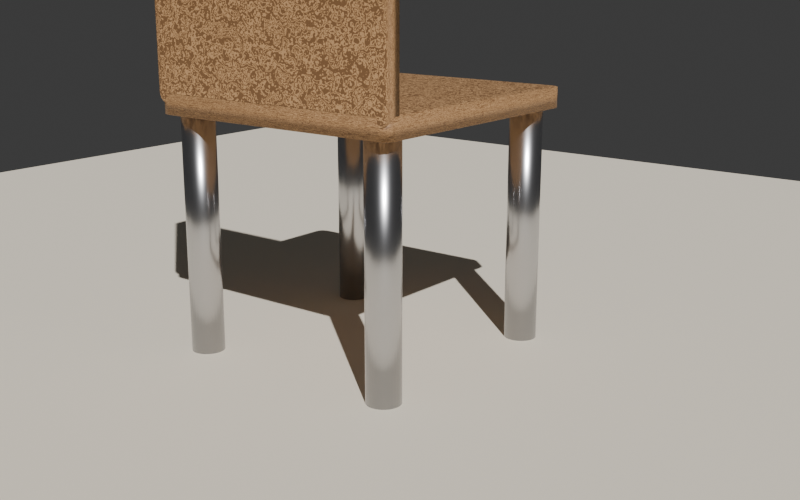

# procedural_wood_node_graph.py — コードでノードグラフを組む

Phase 3 の核心。**Image Texture を使わずに、Noise + Wave + ColorRamp + Bump で木目を完全プロシージャル生成** する。



## コード

```python
--8<-- "snippets/procedural_wood_node_graph.py"
```

## ノードグラフの構造

```
TexCoord ─→ Noise ─→ Wave ─┬─→ ColorRamp ─→ BSDF (Base Color)
                            └─→ Bump ──────→ BSDF (Normal)
                                              ↓
                                            Output (Surface)
```

| ノード | 役割 |
|---|---|
| `TexCoord` | UV/Object 座標を流す（質感の基準）|
| `Noise` | ランダムなノイズパターン（木目の不規則さ）|
| `Wave` | 縞模様（年輪っぽい流れ）|
| `ColorRamp` | 値 → 色 のマッピング（明るい木地↔濃い木目）|
| `Bump` | Height からノーマルを生成（凹凸感）|
| `Principled BSDF` | 最終的な質感計算 |

## ノードを生成する API

```python
node = nt.nodes.new('ShaderNodeXXX')   # タイプ名で生成
node.location = (x, y)                  # UI座標（ノードエディタで見やすく）
```

主なタイプ名:

| タイプ名 | 種類 |
|---|---|
| `ShaderNodeOutputMaterial` | 出力 |
| `ShaderNodeBsdfPrincipled` | Principled BSDF |
| `ShaderNodeTexNoise` | Noise Texture |
| `ShaderNodeTexWave` | Wave Texture |
| `ShaderNodeValToRGB` | Color Ramp |
| `ShaderNodeBump` | Bump |
| `ShaderNodeTexCoord` | Texture Coordinate |
| `ShaderNodeTexImage` | Image Texture（PBR画像用）|
| `ShaderNodeMixRGB` | カラーミックス |
| `ShaderNodeMath` / `ShaderNodeVectorMath` | 数値・ベクトル演算 |

## ノードを繋ぐ API

```python
nt.links.new(出力ソケット, 入力ソケット)
# 例:
nt.links.new(noise.outputs['Fac'], ramp.inputs['Fac'])
```

ソケット名は **ノードの UI に表示されているラベルそのまま**。`outputs['Fac']`, `inputs['Base Color']` など。

## カスタマイズしどころ

- `grain_scale`: 木目の細かさ（小さい=粗い木目、大きい=細かい）
- `base_color` / `dark_color`: 樹種を変える（濃い茶色=ウォールナット、赤茶=チェリー、白っぽい=パイン）
- `bump.inputs['Strength']`: 凹凸感の強さ（0.0〜1.0）

## 落とし穴

- **既存ノードを全削除してから生成** するのが安全。`mat.use_nodes = True` の直後はデフォルトノードがあるので、ループで `nt.nodes.remove(n)`。
- ソケット名は **大文字小文字を区別**（`'Base Color'` であって `'base color'` ではない）
- `Vector` 系の接続は `Object` か `UV` の選択で見た目が変わる
