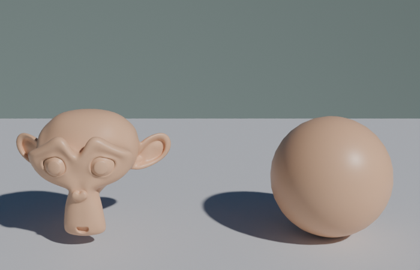

# sky_environment.py — 空からの環境光

World シェーダーに Sky Texture を組み込んで、**空全体を光源にする**。屋外シーンに必須。



## コード

```python
--8<-- "snippets/sky_environment.py"
```

## Sky Type の選択

| `sky_type` | モデル | 特徴 |
|---|---|---|
| `'NISHITA'` | Nishita 散乱モデル | 物理ベースで一番綺麗。Blender 2.90+ |
| `'HOSEK_WILKIE'` | Hosek-Wilkie | 高品質、よく使われる定番 |
| `'PREETHAM'` | Preetham | 古典的、軽い |
| `'SINGLE_SCATTERING'` | 単散乱 | デバッグ向け |

`NISHITA` が利用可能ならそちら推奨。今回の Blender では使えなかったので `HOSEK_WILKIE` を使った。

## 主要パラメータ

| 引数 | 意味 |
|---|---|
| `turbidity` | 大気の濁り具合（1=澄んだ青空、10=曇り）|
| `ground_albedo` | 地面の反射色（0=黒、1=白）|
| `sun_direction` | 太陽方向のベクトル `(x, y, z)` |
| `Background.Strength` | 環境光の強さ（1.0が標準）|

## 直射光と環境光の組み合わせ

Sky Texture **だけ** だと拡散光が中心で、はっきりした影が出ない。**Sun ライト** と組み合わせると:

- Sky Texture: 空からの拡散光（環境光・空の色）
- Sun ライト: 太陽の直射光（はっきりした影）

両方の方向を揃える（`sun_direction` と Sun の `rotation_euler`）と自然に見える。

## Polyhaven HDRI を使う場合

BlenderMCP の「Use assets from Poly Haven」が ON のときは、`mcp__blender__download_polyhaven_asset(asset_id="...", asset_type="hdris", resolution="2k")` で本物のHDRIを取得できる。OFF のときは Sky Texture で代替。
